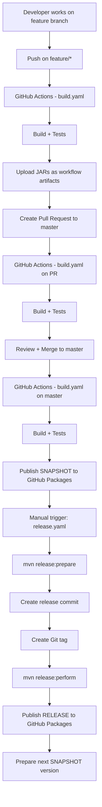
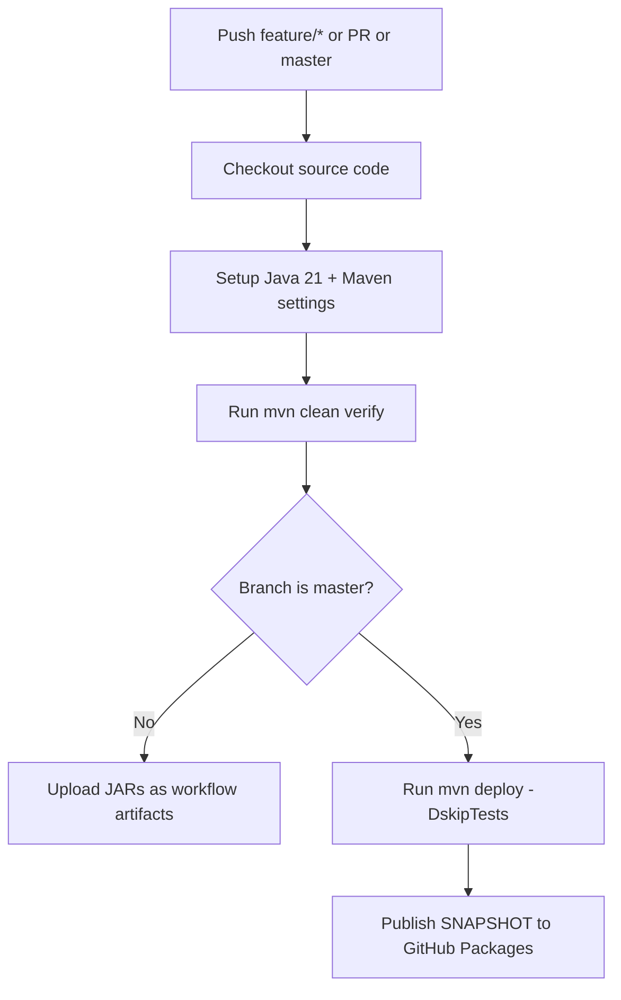
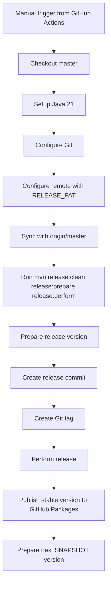

# GitHub CI/CD — Build & Release

Ce document explique le fonctionnement de la CI/CD du projet **spring-boot-aggregator-loom** 
avec **GitHub Actions**, **Maven** et **GitHub Packages**.

---

## Objectif

Le projet utilise deux workflows GitHub Actions :

- `build.yaml` : pour le **build**, les **tests** et la publication des **SNAPSHOT**
- `release.yaml` : pour créer une **release officielle** avec `maven-release-plugin`

---
## Vue d'ensemble



## Workflows
### 1. build.yaml

Ce workflow est exécuté dans les cas suivants :
- push sur master
- push sur feature/**
- pull request vers master

**Rôle du workflow**

Il permet de :

- compiler le projet
- lancer les tests
- générer les JAR
- uploader les JAR comme artifacts GitHub Actions sur les branches de travail
- publier les versions SNAPSHOT sur master

**Résumé du comportement**

| Événement                  | Build | Tests | Upload artifact | Publish SNAPSHOT |
| -------------------------- | ----- | ----- | --------------- | ---------------- |
| Push sur `feature/*`       | Oui   | Oui   | Oui             | Non              |
| Pull Request vers `master` | Oui   | Oui   | Oui             | Non              |
| Push sur `master`          | Oui   | Oui   | Non             | Oui              |

---

**Schéma du workflow `build.yaml`**


---
**Artifacts vs Packages**

Il est important de distinguer deux choses :

**GitHub Actions Artifacts**

Les artifacts sont des fichiers temporaires stockés dans l'interface GitHub Actions.

Exemple :

- user-service.jar
- order-service.jar

Ils servent à :

- télécharger les JAR produits par un build
- vérifier rapidement le résultat d’un run
- partager des fichiers entre jobs

Ils sont visibles ici :
```shell
Actions → Workflow run → Artifacts
```
**GitHub Packages**

Les packages sont des artifacts Maven publiés dans un registre.

Ils servent à :

- distribuer les librairies Maven
- réutiliser les modules dans d'autres projets
- stocker les versions SNAPSHOT et RELEASE

Ils sont visibles ici :

```shell
Repository → Packages
```

### 2. release.yaml

Ce workflow est déclenché manuellement avec workflow_dispatch.

Il ne sert pas au build quotidien.
Il sert à produire une release officielle.

Pourquoi un workflow séparé ?

Parce qu’une release :

- modifie les versions Maven
- crée un commit Git
- crée un tag Git
- pousse sur master
- publie une version stable

C’est une opération plus sensible qu’un simple build.

---
**Schéma du workflow `release.yaml`**



---
### Rôle de `maven-release-plugin`

**Le plugin Maven utilisé est :**
```shell
<plugin>
  <groupId>org.apache.maven.plugins</groupId>
  <artifactId>maven-release-plugin</artifactId>
  <version>3.3.1</version>
  <configuration>
    <tagNameFormat>v@{project.version}</tagNameFormat>
  </configuration>
</plugin>
```
**Ce qu’il fait**

Lors d’une release, il :

1. remplace 1.0.x-SNAPSHOT par 1.0.x
2. commit les fichiers de release
3. crée un tag Git, par exemple v1.0.1
4. exécute mvn deploy
5. remet le projet en version suivante, par exemple 1.0.2-SNAPSHOT
6. commit cette nouvelle version

---
**Cycle de vie d’une version**

````mermaid
flowchart LR
    A[1.0.1-SNAPSHOT] --> B[Release started]
    B --> C[1.0.1]
    C --> D[Tag v1.0.1]
    D --> E[Publish release]
    E --> F[1.0.2-SNAPSHOT]
````
---
### Pourquoi utiliser deux tokens ?

`GITHUB_TOKEN`

Il sert à :

- publier les packages Maven dans GitHub Packages

`RELEASE_PAT`

Il sert à :
- pousser les commits de release
- créer et pousser les tags Git
- bypass la protection de branche sur master

**Pourquoi ne pas utiliser seulement GITHUB_TOKEN ?**

Parce que master est protégée et impose :

- Pull Request obligatoire

Le `GITHUB_TOKEN` seul ne suffisait pas pour pousser les commits créés par `maven-release-plugin`.

---
### Protection de la branche `master`

La branche `master` est protégée par un ruleset **GitHub**.

**Règles principales**

- Pull Request obligatoire avant merge
- Force push interdit
- Suppression interdite
- Bypass autorisé pour Repository admin

**Pourquoi ce bypass est nécessaire ?**

Parce que `release.yaml` doit pouvoir :
- pousser les commits de release
- pousser le tag Git

Sans cela, la release échouerait avec une erreur de type :

````shell
Changes must be made through a pull request
````
---

### Historique Git attendu après une release

**Après une release, l’historique ressemble à ceci :**

````shell
feat: some development change
[maven-release-plugin] prepare release v1.0.1
[maven-release-plugin] prepare for next development iteration
````
Et un tag existe :

````shell
v1.0.1
````
---

### Où voir les résultats

**Artifacts de build**

````shell
Actions → Java build → Run → Artifacts
````
**Packages Maven**

````shell
Repository → Packages
````
**Tags Git**
````shell
Repository → Tags
````
**Workflow de release**
````shell
Actions → Maven Release
````


