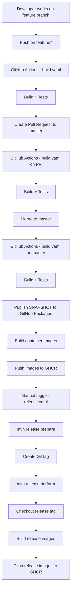
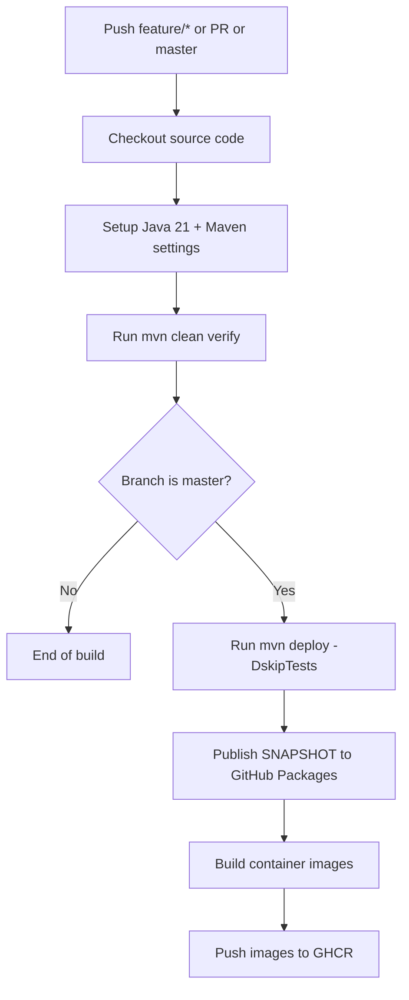
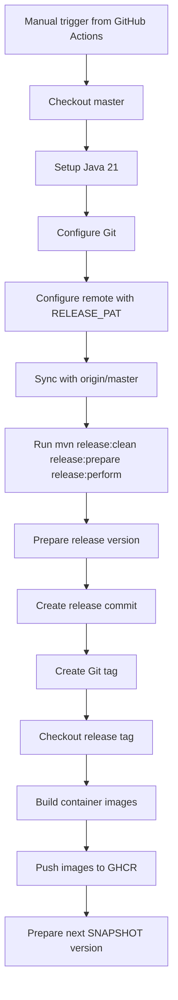

# GitHub CI/CD — Build & Release

Ce document explique le fonctionnement de la CI/CD du projet **spring-boot-aggregator-loom** 
avec **GitHub Actions**, **Maven** et **GitHub Packages**.

---

## Objectif

Le projet utilise deux workflows GitHub Actions :

- `build.yaml` : pour le **build**, les **tests** et la publication des **SNAPSHOT**
- `release.yaml` : pour créer une **release officielle** avec `maven-release-plugin`

---

## Images container

En plus des artifacts Maven, le pipeline construit et publie des images container pour chaque microservice.

Ces images sont construites avec **Paketo Buildpacks** via le plugin Spring Boot **(spring-boot:build-image)** et publiées dans **GitHub Container Registry (GHCR).**

Chaque microservice produit une image:

- user-service
- order-service
- loyalty-service
- aggregator-service

Les images sont visibles dans :

````shell
GitHub → Packages → Container
````
Exemple:
````shell
docker pull ghcr.io/kaninda/user-service:1.0.4-snapshot
docker pull ghcr.io/kaninda/user-service:1.0.3
````
---

## Vue d'ensemble


```mermaid
flowchart TD
    A[Developer works on feature branch] --> B[Push on feature/*]
    B --> C[GitHub Actions - build.yaml]
    C --> D[Build + Tests]

    D --> E[Create Pull Request to master]
    E --> F[GitHub Actions - build.yaml on PR]
    F --> G[Build + Tests]

    G --> H[Merge to master]

    H --> I[GitHub Actions - build.yaml on master]
    I --> J[Build + Tests]
    J --> K[Publish SNAPSHOT to GitHub Packages]
    K --> L[Build container images]
    L --> M[Push images to GHCR]

    M --> N[Manual trigger: release.yaml]
    N --> O[mvn release:prepare]
    O --> P[Create Git tag]
    P --> Q[mvn release:perform]
    Q --> R[Checkout release tag]
    R --> S[Build release images]
    S --> T[Push release images to GHCR]
```
---

## Workflows
### 1. build.yaml

Ce workflow est exécuté dans les cas suivants :
- push sur master
- push sur feature/**
- pull request vers master

**Rôle du workflow**

Il permet de :

- compiler le projet
- lancer les tests
- publier les artifacts Maven SNAPSHOT
- construire les images container des microservices
- publier les images SNAPSHOT dans GHCR

---

**Résumé du comportement**

| Événement                  | Build | Tests | Maven SNAPSHOT | Build images  | Push images |
| -------------------------- | ----- | ----- |----------------| ------------- |-------------|  
| Push sur `feature/*`       | Oui   | Oui   | Non            | Non           | Non         |
| Pull Request vers `master` | Oui   | Oui   | Non            | Non           | Non         |
| Push sur `master`          | Oui   | Oui   | Oui            | Oui           | Oui         |

---

**Schéma du workflow `build.yaml`**

```mermaid
flowchart TD
    A[Push feature/* or PR or master] --> B[Checkout source code]
    B --> C[Setup Java 21 + Maven settings]
    C --> D[Run mvn clean verify]

    D --> E{Branch is master?}
    E -- No --> F[End of build]

    E -- Yes --> G[Run mvn deploy -DskipTests]
    G --> H[Publish SNAPSHOT to GitHub Packages]
    H --> I[Build container images]
    I --> J[Push images to GHCR]
```

---
**Artifacts vs Packages**

Il est important de distinguer deux choses :

**GitHub Actions Artifacts**

Les artifacts sont des fichiers temporaires stockés dans l'interface GitHub Actions.

Exemple :

- user-service.jar
- order-service.jar

Ils servent à :

- télécharger les JAR produits par un build
- vérifier rapidement le résultat d’un run
- partager des fichiers entre jobs

Ils sont visibles ici :
```shell
Actions → Workflow run → Artifacts
```

---

**GitHub Packages**

Les packages sont des artifacts Maven publiés dans un registre.

Ils servent à :

- distribuer les librairies Maven
- réutiliser les modules dans d'autres projets
- stocker les versions SNAPSHOT et RELEASE

Ils sont visibles ici :

```shell
Repository → Packages
```

---

**Construction des images container**

Les images sont construites avec le plugin Spring Boot :

````shell
mvn spring-boot:build-image
````
Le plugin utilise **Paketo Buildpacks** pour créer une **image OCI sans Dockerfile**.

Chaque microservice produit une image:
````shell
ghcr.io/<owner>/<service>:<version>
````
Exemple:
````shell
ghcr.io/kaninda/user-service:1.0.4-snapshot
ghcr.io/kaninda/order-service:1.0.4-snapshot
ghcr.io/kaninda/loyalty-service:1.0.4-snapshot
ghcr.io/kaninda/aggregator-service:1.0.4-snapshot
````

---

### 2. release.yaml

Ce workflow est déclenché manuellement avec:

````shell
workflow_dispatch
````
Il ne sert pas au build quotidien.

Il sert à produire une **release officielle.**

Pourquoi un workflow séparé?

Parce qu’une release:

- modifie les versions Maven
- crée un commit Git
- crée un tag Git
- pousse sur master
- publie une version stable
- construit les images de release

C’est une opération plus sensible qu’un simple build.

---

**Schéma du workflow `release.yaml`**


```mermaid
flowchart TD
    A[Manual trigger from GitHub Actions] --> B[Checkout master]
    B --> C[Setup Java 21]
    C --> D[Configure Git]
    D --> E[Configure remote with RELEASE_PAT]
    E --> F[Sync with origin/master]

    F --> G[Run mvn release:clean release:prepare release:perform]

    G --> H[Prepare release version]
    H --> I[Create release commit]
    I --> J[Create Git tag]

    J --> K[Checkout release tag]

    K --> L[Build container images]
    L --> M[Push images to GHCR]

    M --> N[Prepare next SNAPSHOT version]
```
---
### Images de release
Lors d’une release :

1. Maven crée un tag Git
2. le workflow checkout ce tag
3. les images container sont construites
4. les images sont publiées avec la version release

Exemples :

````shell
ghcr.io/kaninda/user-service:1.0.3
ghcr.io/kaninda/order-service:1.0.3
ghcr.io/kaninda/loyalty-service:1.0.3
ghcr.io/kaninda/aggregator-service:1.0.3
````
---

### Rôle de `maven-release-plugin`

**Le plugin Maven utilisé est :**
```shell
<plugin>
  <groupId>org.apache.maven.plugins</groupId>
  <artifactId>maven-release-plugin</artifactId>
  <version>3.3.1</version>
  <configuration>
    <tagNameFormat>v@{project.version}</tagNameFormat>
  </configuration>
</plugin>
```
**Ce qu’il fait**

Lors d’une release:

1. remplace 1.0.x-SNAPSHOT par 1.0.x
2. commit les fichiers de release
3. crée un tag Git (ex: v1.0.3)
4. exécute mvn deploy
5. remet le projet en version suivante (1.0.x+1-SNAPSHOT)
6. commit cette nouvelle version

---

**Cycle de vie d’une version**

````mermaid
flowchart LR
    A[1.0.3-SNAPSHOT] --> B[Release started]
    B --> C[1.0.3]
    C --> D[Tag v1.0.3]
    D --> E[Publish release]
    E --> F[1.0.4-SNAPSHOT]
````
---
### Pourquoi utiliser deux tokens ?

`GITHUB_TOKEN`

Utilisé pour :
- publier les packages Maven
- publier les images dans GHCR

`RELEASE_PAT`

Il sert à :
- pousser les commits de release
- créer et pousser les tags Git
- bypass la protection de branche sur master

**Pourquoi?**

Parce que master impose:

- Pull Request obligatoire

Le `GITHUB_TOKEN` seul ne ne permet pas au `maven-release-plugin` de pousser directement les commits.

---
### Protection de la branche `master`

La branche `master` est protégée par un ruleset **GitHub**.

**Règles principales**

- Pull Request obligatoire avant merge
- Force push interdit
- Suppression interdite
- Bypass autorisé pour Repository admin

**Pourquoi ce bypass?**

Parce que `release.yaml` doit pouvoir :
- pousser les commits de release
- pousser le tag Git

Sans cela, la release échouerait avec une erreur de type :

````shell
Changes must be made through a pull request
````
---

### Historique Git attendu après une release

**Après une release, l’historique ressemble à ceci :**

````shell
feat: some development change
[maven-release-plugin] prepare release v1.0.3
[maven-release-plugin] prepare for next development iteration
````
Et un tag existe :

````shell
v1.0.3
````
---

### Où voir les résultats

**Artifacts de build**

````shell
Actions → Java build → Run → Artifacts
````
---

**Packages Maven**

````shell
Repository → Packages
````
---

**Images container**
````shell
Repository → Packages
````
ou via Docker:
````shell
docker pull ghcr.io/kaninda/user-service:1.0.4-snapshot
````

---

**Tags Git**
````shell
Repository → Tags
````

---

**Workflow de release**
````shell
Actions → Maven Release
````


